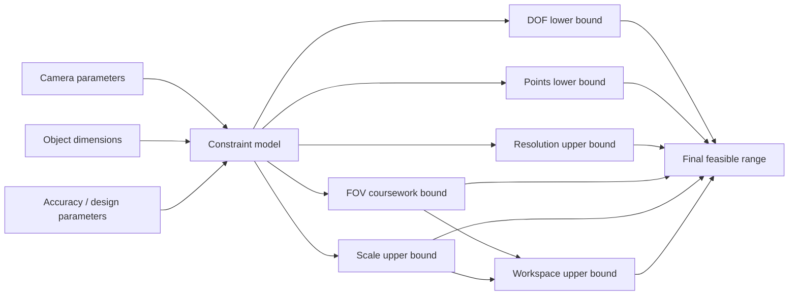
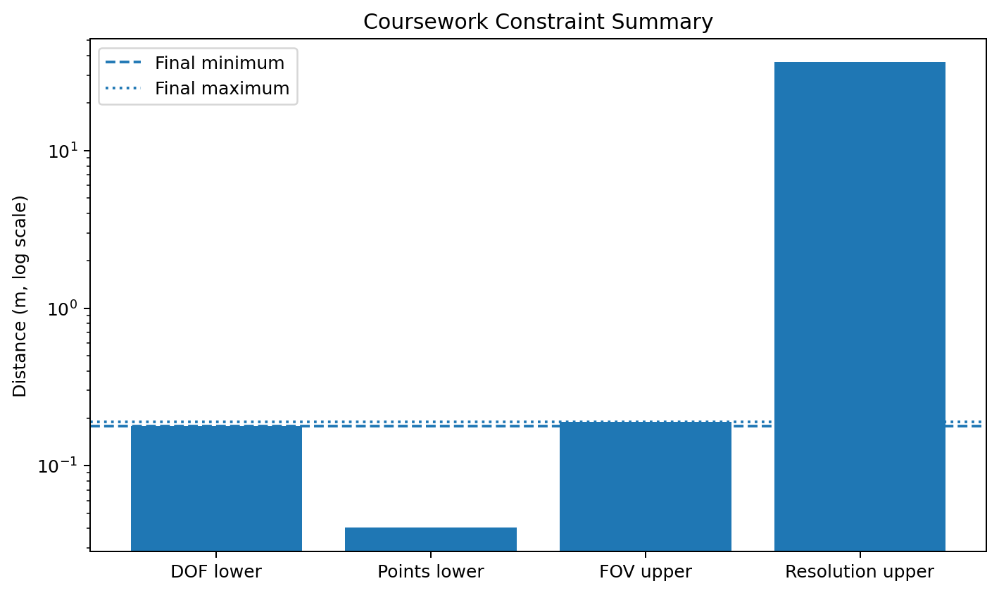

# Photogrammetry Camera Distance Planner

A small, reproducible Python project for evaluating camera-to-object distance constraints in **close-range photogrammetry**.

The project refactors a graduate Close-Range Photogrammetry coursework script into a reusable implementation with structured inputs, validation, automated tests, and a reproducible example.

## What the project computes

The coursework model evaluates several distance constraints:

- **Depth of field (DOF)** lower bound
- **Point-distribution** lower bound
- **Resolution** upper bound
- **Field-of-view (FOV)** coursework bound
- **Scale** upper bound
- **Workspace** upper bound

The final range is obtained from the most restrictive lower and upper constraints.



## Coursework case reproduced by this repository

The included example uses:

| Parameter | Value |
|---|---:|
| Focal length | 4.8933 mm |
| Sensor width | 6.4736 mm |
| Sensor height | 4.8608 mm |
| Image width | 9248 px |
| Image height | 6944 px |
| Object width | 162 mm |
| Object height | 52 mm |
| F-number | 2.8 |
| Image measurement precision | 0.2 px |
| Minimum target pixels | 10 |
| Point-count parameter | 20 |

Running the example reproduces the numerical output of the original coursework script.

## Results

| Constraint | Distance |
|---|---:|
| Resolution upper bound | 36.3502 m |
| FOV coursework upper bound | 0.1903 m |
| Scale upper bound | 8495.4238 m |
| Workspace upper bound | 0.1903 m |
| DOF lower bound | 0.1793 m |
| Points lower bound | 0.0403 m |

### Final allowable range

**0.1793 m <= D <= 0.1903 m**

For this parameter set:

- Limiting lower constraint: **Depth of Field**
- Limiting upper constraint: **FOV / Workspace in the coursework model**
- Feasible interval width: approximately **11 mm**



## Repository structure

```text
photogrammetry-camera-distance-planner/
├── README.md
├── LICENSE
├── requirements.txt
├── .gitignore
├── src/
│   ├── __init__.py
│   └── distance_planner.py
├── examples/
│   ├── coursework_example.py
│   └── plot_constraints.py
├── tests/
│   ├── __init__.py
│   └── test_coursework_case.py
└── figures/
    └── constraint_summary.png
```

## Installation

```bash
git clone https://github.com/Reza-pourali/photogrammetry-camera-distance-planner.git
cd photogrammetry-camera-distance-planner
pip install -r requirements.txt
```

## Run the coursework example

```bash
python examples/coursework_example.py
```

Expected final output includes:

```text
Final allowable range
-----------------------------------------------
0.1793 m <= D <= 0.1903 m
Feasible                      : True
Limiting lower constraint     : DOF
Limiting upper constraint     : FOV (coursework model)
```

## Use it from Python

```python
from src.distance_planner import (
    CameraParameters,
    ConstraintParameters,
    ObjectGeometry,
    analyze_distance_range,
)

camera = CameraParameters(
    focal_length_mm=4.8933,
    sensor_width_mm=6.4736,
    sensor_height_mm=4.8608,
    image_width_px=9248,
    image_height_px=6944,
)

object_geometry = ObjectGeometry(
    width_mm=162.0,
    height_mm=52.0,
)

result = analyze_distance_range(
    camera,
    object_geometry,
    ConstraintParameters(),
)

print(result.final_min_m, result.final_max_m)
```

## Testing

Run:

```bash
python -m unittest tests/test_coursework_case.py
```

The main regression test verifies that the refactored implementation reproduces the original coursework values.

## Visualization

To regenerate the constraint figure:

```bash
python examples/plot_constraints.py
```

## Important modeling note

This repository deliberately preserves the **constraint equations and bound definitions used in the original coursework script**.

In particular, the original implementation names and uses the FOV expression as an **upper bound** when assembling the final interval. This repository labels it `FOV coursework upper bound` to make that provenance explicit rather than silently changing the project model.

Accordingly, this repository should be read as a clean and reproducible implementation of that coursework model. Independent validation of each equation for a different camera network or measurement-design standard is outside the current scope.

## Research relevance

This project demonstrates experience with:

- close-range photogrammetric design
- camera and sensor parameters
- imaging-geometry constraints
- engineering computation
- Python refactoring
- reproducible numerical testing
- scientific visualization

It complements my broader interests in **3D computer vision, point clouds, camera geometry, and deep learning**.

## Academic context

Graduate coursework in **Close-Range Photogrammetry**  
K. N. Toosi University of Technology

## Author

**Reza Pourali**  
M.Sc. Student in Photogrammetry  
K. N. Toosi University of Technology
